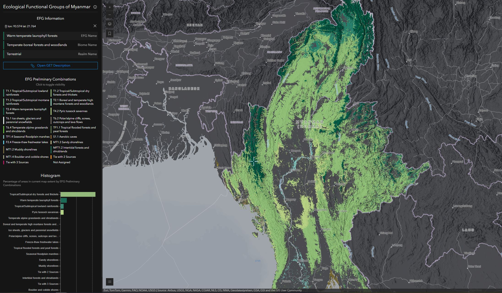

# Ecological Functional Groups of Myanmar

The [Group on Earth Observations (GEO)'s Ecosystem Atlas](https://earthobservations.org/solutions/incubators/global-ecosystems-atlas) will bring together high-quality global, regional and national ecosystems maps into a single, open, online resource. This "Ecological Functional Groups of Myanmar" application supports the first example of the initial steps to produce a prototype atlas. The ability to see the quality and compatibility of the source ecosystems maps and how they can be cross-walked, synthesized and presented as a coherent information product is vital to the success of the atlas. This example application, focused on Myanmar, is an initial test to demonstrate the challenges and possibilities involved in compiling the Ecosystem Atlas. 

[View it live](https://livingatlas.arcgis.com/labs/efg-myanmar/)



## Getting Started
Before you start, make sure you have a fresh version of [Node.js](https://nodejs.org/en/) and NPM installed. The current Long Term Support (LTS) release is an ideal starting point.

1. Fork this repository and clone your own fork to your computer: 
    ```sh
    git clone https://github.com/vannizhang/EFGs-Myanmar.git
    ```


2. From the project's root directory, install the required packages (dependencies):

    ```sh
    npm install
    ```

3. To run and test the app on your local machine (http://localhost:8080):

    ```sh
    npm run start
    ```

    This will start a server instance and begin listening for connections from localhost on port `8080`.

4. To build/deploye the app, you can run:

    ```sh
    npm run build
    ```

    This will place all files needed for deployment into the `/dist` directory.

## Issues
Find a bug or want to request a new feature? Please let me know by submitting an issue.

## Licensing

Copyright 2024 Esri

Licensed under the Apache License, Version 2.0 (the "License");
you may not use this file except in compliance with the License.
You may obtain a copy of the License at

   http://www.apache.org/licenses/LICENSE-2.0

Unless required by applicable law or agreed to in writing, software
distributed under the License is distributed on an "AS IS" BASIS,
WITHOUT WARRANTIES OR CONDITIONS OF ANY KIND, either express or implied.
See the License for the specific language governing permissions and
limitations under the License.

A copy of the license is available in the repository's [LICENSE](./LICENSE) file.